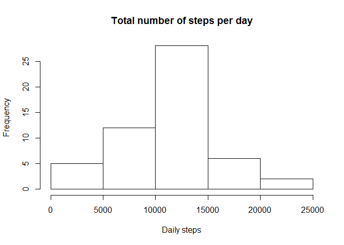
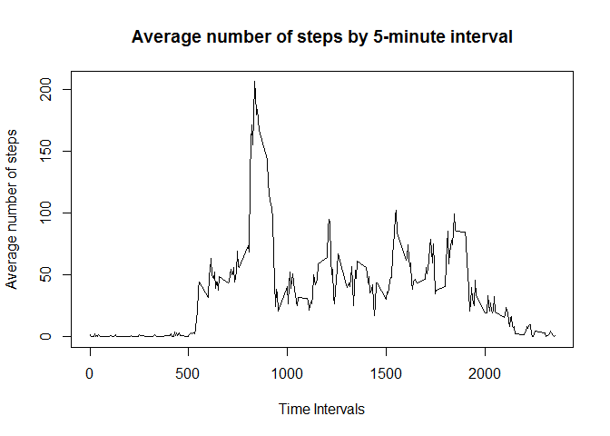
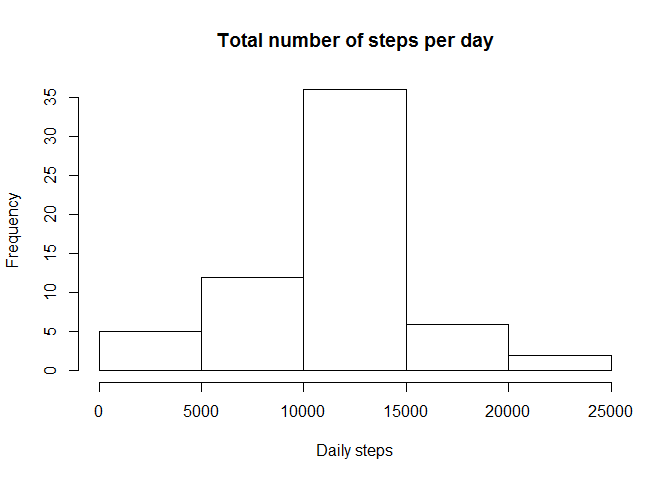
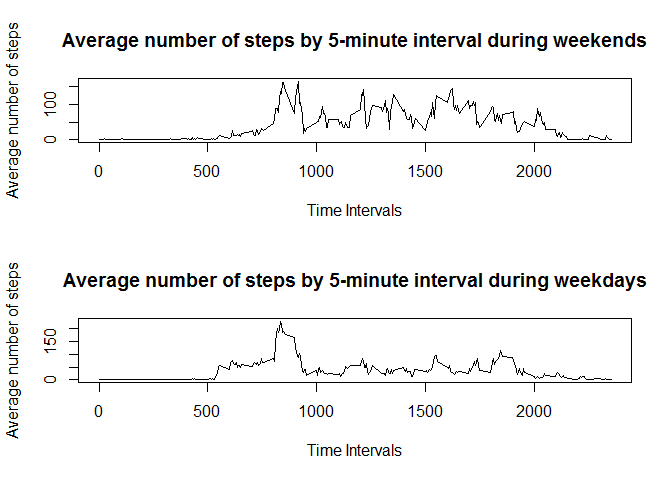

# Reproducible Research - Course Project 1
JMSG  
13 de abril de 2017  
## Load the data file into a data frame

```r
act <- read.csv("activity.csv", as.is = TRUE)
```

## Remove the NA values

```r
act_clean <- act[complete.cases(act), ]
```

#What is mean total number of steps taken per day?

## Calculate the total number of steps taken per day

```r
steps_per_day <- aggregate(steps ~ date, act_clean, sum)
```

## Make a histogram of the total number of steps taken each day

```r
hist(steps_per_day$steps, main = "Total number of steps per day", xlab = "Daily steps")
```

<!-- -->

## Calculate the mean and median of the total number of steps taken per day

```r
round(mean(steps_per_day$steps))
```

```
## [1] 10766
```

```r
median(steps_per_day$steps)
```

```
## [1] 10765
```

#What is the average daily activity pattern?

## Make a time series plot (i.e. type = "l") of the 5-minute interval (x-axis) and the average number of steps taken, averaged across all days (y-axis)

```r
avg_steps_per_int <- aggregate(steps ~ interval, act_clean, mean)
plot(avg_steps_per_int$interval, avg_steps_per_int$steps, type='l', col=1, main="Average number of steps by 5-minute interval", xlab="Time Intervals", ylab="Average number of steps")
```

<!-- -->

## Which 5-minute interval, on average across all the days in the dataset, contains the maximum number of steps?

```r
int_max <- which.max(avg_steps_per_int$steps)
print (paste("The interval is ", avg_steps_per_int[int_max, ]$interval))
```

```
## [1] "The interval is  835"
```

#Imputing missing values

##Calculate and report the total number of missing values in the dataset

```r
mis_val <- act[!complete.cases(act), ]
nrow(mis_val)
```

```
## [1] 2304
```

##Devise a strategy for filling in all of the missing values in the dataset and create a new dataset that is equal to the original dataset but with the missing data filled in. 

```r
act_2<- act
for (i in 1:nrow(act)) {
    if(is.na(act$steps[i])) {
        act_2$steps[i] <- avg_steps_per_int$steps[which(avg_steps_per_int$interval == act$interval[i])]
    }
}
```

##Make a histogram of the total number of steps taken each day and Calculate and report the mean and median total number of steps taken per day. 

```r
steps_per_day_2 <- aggregate(steps ~ date, act_2, sum)
```

##Make a histogram of the total number of steps taken each day

```r
hist(steps_per_day_2$steps, main = "Total number of steps per day", xlab = "Daily steps")
```

<!-- -->

##Calculate the mean and median of the total number of steps taken per day

```r
round(mean(steps_per_day_2$steps))
```

```
## [1] 10766
```

```r
median(steps_per_day_2$steps)
```

```
## [1] 10766.19
```

#Are there differences in activity patterns between weekdays and weekends?

##Create a new factor variable in the dataset with two levels - "weekday" and "weekend" indicating whether a given date is a weekday or weekend day.

```r
day <- weekdays(as.Date(act_2$date, '%Y-%m-%d'))
for (i in 1:nrow(act_2)) {    
    if  (!(day[i] == 'sábado' || day[i] == 'domingo')) {
        act_2$day[i] <- 'Weekday'
    } else {
        act_2$day[i] <- 'Weekend'
    }
}
```

##Make a panel plot containing a time series plot (i.e. type = "l") of the 5-minute interval (x-axis) and the average number of steps taken, averaged across all weekday days or weekend days (y-axis).

```r
avg_steps_per_int_we<- subset(act_2, day == "Weekend")
avg_steps_per_int_d<- subset(act_2, day == "Weekday")
avg_steps_per_int_we2 <- aggregate(steps ~ interval, avg_steps_per_int_we, mean)
avg_steps_per_int_d2 <- aggregate(steps ~ interval, avg_steps_per_int_d, mean)
par(mfrow=c(2,1)) 
plot(avg_steps_per_int_we2$interval, avg_steps_per_int_we2$steps, type='l', col=1, main="Average number of steps by 5-minute interval during weekends", xlab="Time Intervals", ylab="Average number of steps")
plot(avg_steps_per_int_d2$interval, avg_steps_per_int_d2$steps, type='l', col=1, main="Average number of steps by 5-minute interval during weekdays", xlab="Time Intervals", ylab="Average number of steps")
```

<!-- -->
